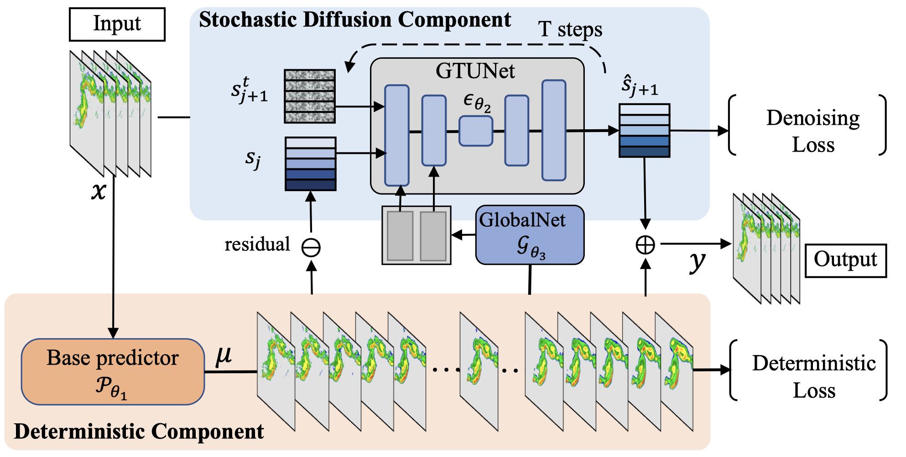

# DiffCast-CVPR2024
Official implementation of "[DiffCast: A Unified Framework via Residual Diffusion for Precipitation Nowcasting](https://arxiv.org/abs/2312.06734)"



## Introduction

DiffCast is a precipitation nowcasting framework based on  diffusion model and a deterministic predictive backbone, which can be achieved with various spatio-temporal predictive models optimized with deterministic loss (e.g., SimVP, Earthformer, ConvGRU, PhyDNet et al).

This repository contains the part of training and inference code for using DiffCast to make predictions (5 --> 20) on SEVIR datasets. 

> Other pulbic datasets in our paper are preprocessed with `h5` files. Feel free to concat me (deminy@stu.hit.edu.cn,deminyu98@gmail.com) if you have any questions about code or datasets.

## Code

### Environment

```shell
conda env create -f env.ymal
conda activate diffcast
```
<details open>
<summary>Optional Accelerate Env</summary>

 We apply the `HuggingFace Accelerator` in our code to utilize multi-gpus. 
 One can config the accelerator env before runing code.

-  config the accelerate: `accelerate config`      
- apply accelerate to run code: `accelerate launch *.py`
</details>

### Resource

pretrained DiffCast_PhyDNet: [GooleDrive](https://drive.google.com/file/d/1y8BvYz3U_awm1eAYqXBy6tgbMy8t40Xr/view?usp=sharing)


### Toy prediction visiualization 
We give some demos from SEVIR to easily check the predictive performance of DiffCast_PhyDNet. Before that, you need to [download](https://drive.google.com/file/d/1y8BvYz3U_awm1eAYqXBy6tgbMy8t40Xr/view?usp=sharing) the pretrained checkpoint and put it in `resources/`
```shell
python sample_batch.py
```

### Evaluation
```shell
# Note: Config the dataset path in `dataset/get_dataset.py` before running.
python run.py --backbone phydnet --use_diff --eval --ckpt_milestone resources/diffcast_phydnet_sevir128.pt  
```
### Backbone Training
```shell
python run.py --backbone simvp
```
You can check the experimental configuration by
```shell
python run.py -h
```

## Acknowledgement

We refer to implementations of the following repositories and sincerely thank their contribution for the community:
- [denoising_diffusion_pytorch](https://github.com/lucidrains/denoising-diffusion-pytorch/tree/main/denoising_diffusion_pytorch)
- [Prediff](https://github.com/gaozhihan/PreDiff)
- [RVD](https://github.com/buggyyang/RVD)
- [OpenSTL](https://github.com/chengtan9907/OpenSTL/blob/OpenSTL-Lightning/README.md)

## Citation
```
@inproceedings{Yu2024diffcast,
  title={DiffCast: A Unified Framework via Residual Diffusion for Precipitation Nowcasting},
  author={Demin Yu and Xutao Li and Yunming Ye and Baoquan Zhang and Chuyao Luo and Kuai Dai and Rui Wang and Xunlai Chen},
  booktitle={The IEEE/CVF Conference on Computer Vision and Pattern Recognition},
  year={2024}
}
```
